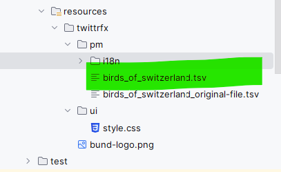

# twittr-readme
Here some explanation about the programm :-)
## For the user
### Shortcuts
- Ctrl + S | Saves the bird list to the file in the target folder
- Del | Removes the current bird entry
- Esc | Close the detail bird view

### Default picture
When creating a new image a default picture is added. This can be replaced by changing the url. This picture is show as well, when the current content of the img url field not delivers a valid content


## For the dev (Features)
### File location
The original content is located in under resources/tittrfx/pm. The saved content is in the target folder of the application (same folder structure)



### Internationalization
The translation are centrally located at the translation files in the folder
```resources/twittrfw/pm/i18n```
### Undo/Redo
The redo/undo works with the change listeners on the individual BirdPM instaces an keep track of changes accross all birds
